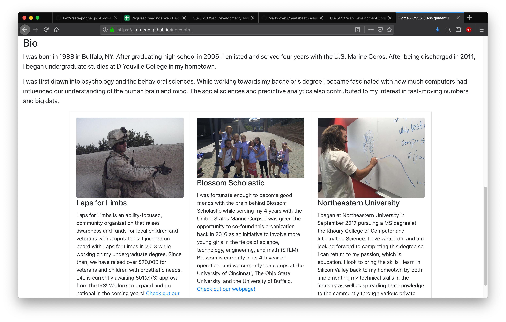

# Project 1 - Window to the World

Student Homepage

James Borzillieri

[NEU CS5610](http://johnguerra.co/classes/webDevelopment_spring_2019/)

## Objective

My Objective is to build the groundwork for a website to market my technical work and obtain greater visibility for the organizations I am affiliated with.

## Screenshot



## Installing

Clone the repository

```
git clone https://github.com/jimfuego/jimfuego.github.io.git
```

Open web browser

```
file -> open -> /filepath/repository/index.html
```

Click [here](http://www.youtube.com) to see the demo!

## Built With

* [Bootstrap](https://getbootstrap.com/) - The web framework used
* [CSS](https://developer.mozilla.org/en-US/docs/Web/CSS) - Styling
* [JavaScript](https://www.javascript.com/) - The language of the web!
* [GitHub](http://www.github.com/) - Remote repo
* [Git](https://git-scm.com/) - Version control

## Author

* **James Borzillieri** - *Initial work* - [Personal-site](https://jimfuego.github.io/)

## License

This project is licensed under the MIT License - see the [LICENSE](LICENSE) file for details
